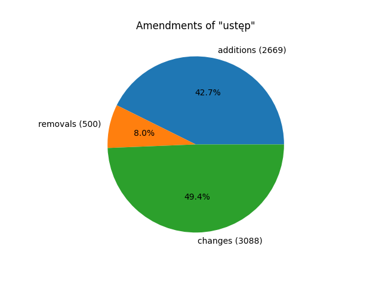

# Solution to NLP labs 1

Task: https://github.com/apohllo/nlp/blob/master/1-regexp.md

## Count amendments by phrase
Amendments are found by specific words that should appear in a text: \
additions regex: `dodaje się ([\w§]+)`
removals regex: `skreśla się ([\w§]+)`
changes regex: `([\w§]+)\.* \d+ otrzymuje brzmienie`

Amendments to "ustęp":

 