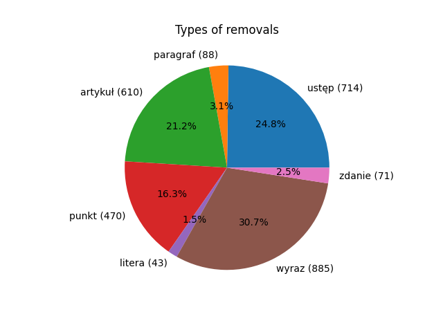
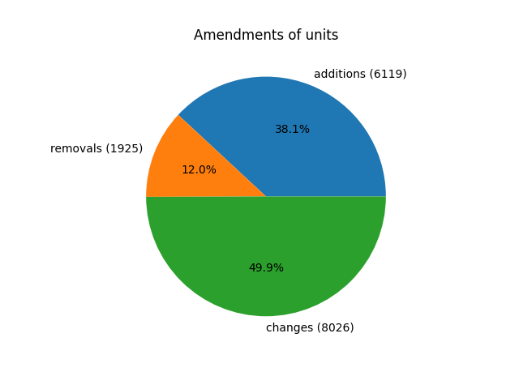

# Solution to NLP labs 1

Task: https://github.com/apohllo/nlp/blob/master/1-regexp.md

## Count amendments by phrase
Amendments are found by specific words that should appear in a text: \
additions regex: `dodaje[\s]+się[\s]+([\w§]+)` \
removals regex: `(?:skreśla[\s]+się[\s]+|uchyla[\s]+się[\s]+)([\w§]+)` \
changes regex: `([\w§]+)\.*[\s]+\d+[\s]+otrzymuje brzmienie`

As a "unit" on the next two graphs we treat: ustęp, paragraf, artykuł, punkt.

Amendments of units total:

Amendments of units by year:

 
 
## Inflectional word counter
Regexs:\
Word "ustawa": `(ustaw)(a|ą|ach|ami|ę|ie|om|y)?\b`\
Word "ustawa" followed by "z dnia": `(ustaw)(a|ą|ach|ami|ę|ie|om|y)?\b+(?=\s+z\s+dnia)`\
Word "ustawa" not followed by "z dnia": `(ustaw)(a|ą|ach|ami|ę|ie|om|y)?\b+(?!\s+z\s+dnia)`\
Word "ustawa" following "o zmianie": `(?<!o\s+zmianie\s+)(ustaw)(a|ą|ach|ami|ę|ie|om|y)?\b`

 

 ### Small mistakes
 At the beginning the second and third point were set to `(ustaw)(\b|a|ą|ach|ami|ie|om|y)(?!\s+z\s+dnia)` and `(ustaw)(\b|a|ą|ach|ami|ie|om|y)(?!\s+z\s+dnia)`. Their sum was bigger by one than the count from the first point. The problematic place (matched twice) was `ustawach z dnia` in `1994_473.txt`. It happened because `ustawach` is prefixed by `ustawa` and both are correct matches so the first regex matched `ustawach z dnia` and the second matched `ustawa(~z dnia)` so it was counted twice. `\b` at the end solves problem. 