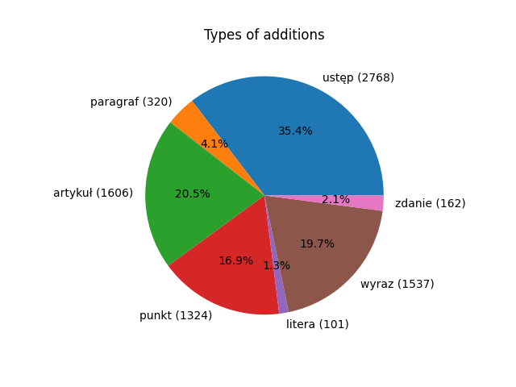
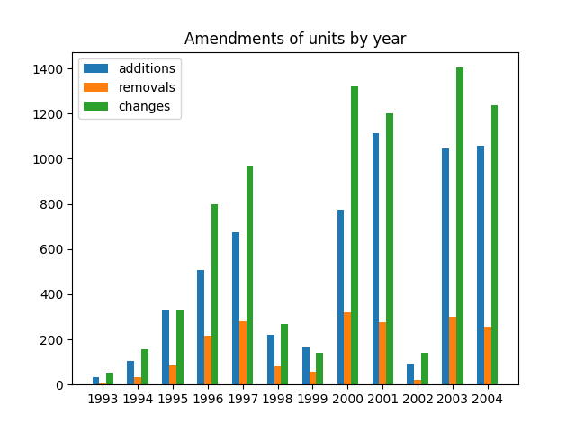

# Solution to NLP labs 1

Task: https://github.com/apohllo/nlp/blob/master/1-regexp.md

## Count amendments by phrase
Amendments are found by specific words that should appear in a text: \
additions regex: `dodaje się ([\w§]+)` \
removals regex: `skreśla się ([\w§]+)` \
changes regex: `([\w§]+)\.* \d+ otrzymuje brzmienie`

As a "unit" on the next two graphs we treat: ustęp, paragraf, artykuł, punkt.

Amendments of units total:

Amendments of units by year:

 
 
## Inflectional word counter
Regexs:\
Word "ustawa": `(ustaw)(\b|a|ą|ach|ami|ie|om|y)`\
Word "ustawa" followed by "z dnia": `(ustaw)(\b|a|ą|ach|ami|ie|om|y)(?= z dnia)`\
Word "ustawa" not followed by "z dnia": `(ustaw)(\b|a|ą|ach|ami|ie|om|y)(?! z dnia)`\
Word "ustawa" following "o zmianie": `(?<!o zmianie )(ustaw)(\b|a|ą|ach|ami|ie|om|y)`

 